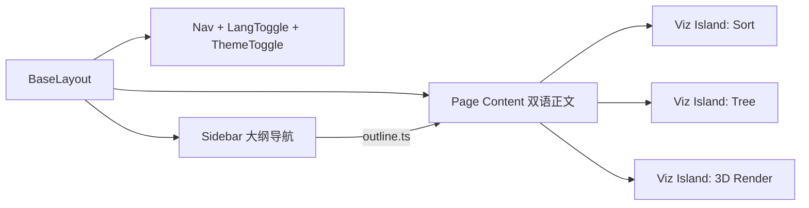

## 用户需求

- 基于现有 README 大纲，从零搭建一个静态、可交互的计算机科学知识汇总站（面向游戏开发），可部署到 GitHub Pages。
- 所有正文支持中英文切换：同一页面双语并存，一键切换显示。
- 支持知识可视化（数据结构数组/树、计算机结构图形化、图形学 3D 渲染表现），部分知识可交互（排序、滑动窗口、BFS 等）。

## 产品概览

一个以"笔记 + 可视化"为核心的学习站点：左侧分层大纲导航，右侧正文 + 嵌入式可视化组件。暗色科技风、玻璃拟态面板、可读性强，支持中英对照与明暗主题切换。

## 核心功能

- 完整细纲分级导航
- 中英双语切换（localStorage 持久化）
- 排序算法交互可视化（播放/步进/调速）
- 树结构图形化可视化（SVG）
- 图形学 3D 渲染占位（可用 Three.js / 原生 WebGL / WebGL2 实现，鼓励更基础的渲染管线演示）

## 各主题细纲

### 算法与数据结构

#### 数据结构

- 数组与动态数组
- 链表（单/双/循环）
- 栈与队列
- 哈希表
- 树（二叉/BST/AVL/红黑/堆/Trie）
- 图（邻接表/邻接矩阵）
- 并查集

#### 算法

- 排序（快排/归并/堆排/桶排）
- 查找（二分）
- 递归与分治
- 动态规划
- 贪心
- 回溯
- 滑动窗口
- 双指针
- BFS / DFS
- 最短路径（Dijkstra / A*）

#### 常见算法题目类型

- 数组与字符串
- 链表
- 树与图遍历
- 动态规划
- 滑动窗口与双指针
- 回溯与排列组合
- 并查集与拓扑排序

### 计算机结构

- 冯·诺依曼架构
- CPU（ALU/寄存器/流水线/分支预测）
- 存储层级（Cache/RAM/虚拟内存）
- 指令集与汇编基础
- 总线与 I/O
- GPU 架构（与图形学关联）

### 计算机网络

- OSI 与 TCP/IP 模型
- HTTP / HTTPS
- TCP / UDP
- DNS
- WebSocket
- CDN 与联机优化

### 图形学基础

- 坐标系统与变换矩阵
- 光栅化
- 光照模型（Phong / PBR）
- 纹理与采样
- 着色器（顶点/片元）
- 相机与投影
- 3D 渲染管线（交互占位）

### 常用编程语言

#### C++

- 内存管理与指针
- 模板与泛型
- STL 容器与算法
- RAII 与智能指针

#### Python

- 语法与数据结构
- 标准库与工具链

### 数据库

#### 关系型数据库

- SQL 基础
- 索引与事务
- 范式与连接

#### 非关系型数据库

- KV / 文档数据库
- 图数据库与游戏存档

## Tech Stack Selection

- 框架：Astro（内容优先，构建产物纯静态，交互岛可嵌入可视化组件，GitHub Pages 部署零负担）
- 样式：Tailwind CSS（@astrojs/tailwind 集成）
- 可视化：不限具体库，按场景选用最方便/动画效果最好的方案——2D 简单图形可用 SVG / Canvas（及 D3.js、p5.js 等）；3D 与图形学可用 Three.js，也可直接用原生 WebGL / WebGL2 实现更基础的光栅化、着色器与渲染管线逻辑。
- 交互岛：原生 TypeScript（Astro island，client:visible/load），避免引入 React/Vue 额外依赖
- i18n：前端 DOM 切换（data-i18n 标记 + 字典 + localStorage），无 SSR 依赖
- 部署：GitHub Actions 构建并发布至 gh-pages；astro.config 配置 base 与 site

## Implementation Approach

- 策略：以 Astro 内容优先架构搭建站点外壳；细纲作为单一导航数据源（src/content/outline.ts）；正文用 Astro 组件编写，双语文本以 data-i18n 属性标记；可视化作为 island 组件按需挂载。
- 关键技术决策：
- 选 Astro 而非 Next/Docusaurus：产物纯静态、构建快、GitHub Pages 友好，契合"静态可交互"诉求。
- 交互岛用原生 TS 而非框架：可视化状态简单，原生 TS 体积更小、依赖更少；3D/图形学可按需引入 Three.js 或原生 WebGL/WebGL2，库的选择以效果与便利为准，不受限制。
- i18n 用同一页双语切换而非独立路由：对照学习更直观，实现轻量、无重复内容维护。
- 性能与可靠性：可视化组件按需挂载（client:visible）避免首屏阻塞；3D/图形学依赖（Three.js 或 WebGL 封装）仅在对应页加载并由打包器代码分割；动画统一用 requestAnimationFrame，组件卸载时取消动画、释放 WebGL 上下文与事件监听，防止内存泄漏。
- 避免技术债：复用 BaseLayout/Nav/Sidebar；可视化组件统一接口（init/play/step/reset），便于后续扩展更多算法与图形。

## Implementation Notes

- 部署关键：astro.config.mjs 设置 base: '/ComputerScienceForGameDevNotebook/' 与 site: 'https://<user>.github.io'，静态资源用相对路径或 import.meta.env.BASE_URL，避免 404。
- 双语：提供 i18n 字典与切换脚本，持久化到 localStorage，默认跟随浏览器语言。
- 可视化组件在 onMount 初始化、onDestroy 清理 rAF 与监听；排序/树可视化参数（数组、速度）可配置。
- 不改 README 既有语义；新增细纲作为可扩展数据，便于后续增补正文。

## Architecture Design

### 系统架构

内容外壳（Astro 布局/组件）+ 数据驱动导航（outline.ts）+ 按需挂载的可视化岛。页面渲染时由 Sidebar 读取 outline 生成层级导航，正文按主题加载，可视化岛仅在进入视口时初始化。



## Directory Structure

```
astro.config.mjs              # [MODIFY/NEW] Astro 配置：static 输出、base/site（GitHub Pages）、Tailwind 集成
package.json                  # [NEW] 依赖与脚本（dev/build/preview）
tsconfig.json                 # [NEW] TypeScript 配置
tailwind.config.mjs           # [NEW] Tailwind 主题（暗色科技色板）
.github/workflows/deploy.yml  # [NEW] GitHub Actions：构建并部署到 gh-pages
public/favicon.svg            # [NEW] 站点图标
src/
  layouts/BaseLayout.astro    # [NEW] HTML 骨架：字体、主题变量、Nav/Sidebar 插槽、全局样式引入
  components/
    Nav.astro                 # [NEW] 顶部导航栏：标题、语言切换、主题切换
    Sidebar.astro             # [NEW] 左侧大纲导航，接收 outline 数据递归渲染
    LangToggle.ts             # [NEW] 双语切换 island：读写 localStorage，切换 data-lang
    ThemeToggle.ts            # [NEW] 明暗主题切换 island
    viz/
      SortVisualizer.astro    # [NEW] 排序交互可视化（SVG/Canvas）：播放/步进/调速，统一 Viz 接口
      TreeVisualizer.astro    # [NEW] 树结构 SVG 可视化：节点/边绘制与高亮
      Render3D.astro          # [NEW] 图形学 3D 渲染占位：可用 Three.js 或原生 WebGL/WebGL2 实现基础场景/相机/立方体/着色器
  i18n/
    index.ts                  # [NEW] 语言字典、类型定义与切换逻辑
  content/
    outline.ts                # [NEW] 细纲数据结构（导航单一数据源），含各主题子项与路由
  pages/
    index.astro               # [NEW] 首页/总览：站点说明 + 主题卡片
    algorithm/sorting.astro   # [NEW] 排序可视化示例页（双语正文 + SortVisualizer）
    datastructure/tree.astro  # [NEW] 树可视化示例页（双语正文 + TreeVisualizer）
    graphics/render.astro     # [NEW] 3D 渲染占位页（双语正文 + Render3D，Three.js 或 WebGL/WebGL2）
    (其余主题占位页，结构同上，后续补正文)
  styles/global.css           # [NEW] Tailwind 指令 + 玻璃拟态/暗色基础样式
```

## Key Code Structures

```ts
// src/i18n/index.ts
export type Lang = 'zh' | 'en';
export interface I18nText { zh: string; en: string; }
export function t(text: I18nText, lang: Lang): string;
export function getStoredLang(): Lang;
export function setStoredLang(lang: Lang): void;

// 可视化组件统一接口（原生 TS island 约定）
export interface VizController {
  init(): void;
  play(): void;
  step(): void;
  reset(): void;
  destroy(): void;
}
```

## Design Style

采用暗色科技风 + 玻璃拟态（Glassmorphism）设计。深色背景衬托可视化图形，半透明玻璃面板层级分明；顶部青→紫渐变强调色；微动效涵盖导航悬停发光、侧边栏平滑展开、可视化播放过渡。响应式：桌面端左侧固定导航 + 右侧内容，移动端折叠为抽屉式导航。整体兼顾可读性与"笔记/可视化"学习氛围。