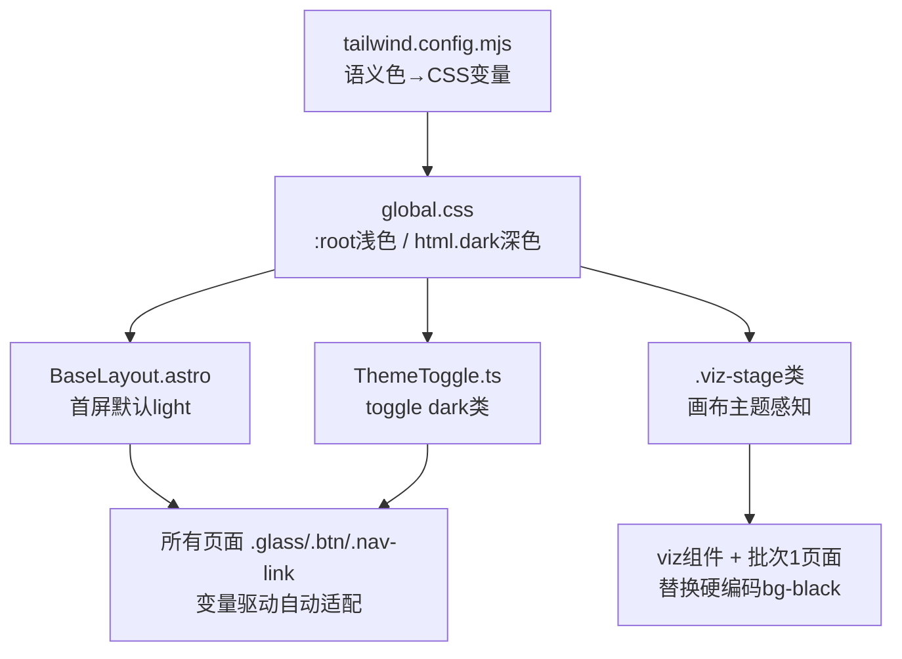

## 产品概述

针对现有 CS·GameDev Notebook 站点的三个问题进行修复与增强：布局对齐、配色阅读体验、知识内容补全，并推进下一开发批次。

## 核心功能

- **顶栏与侧栏对齐**：重构 Nav 结构，使顶部玻璃栏左右边沿与下方侧栏/主内容区精确对齐，消除 24px 错位。
- **浅色阅读优先主题**：将默认主题从深色反转为浅色（类纸张文档风），深色作为可切换项。正文对比度提升，卡片更清晰，背景光晕在浅色下移除；可视化画布背景随主题切换。
- **知识内容补全**：为现存较薄页面（树/排序/3D渲染）补充知识性描述、C++ 代码块与复杂度分析，保留原有可视化交互。
- **批次 2 新页面**：创建 `graph`（图）与 `union-find`（并查集）两页，含双语内容、对比表、轻量交互与代码。

## 视觉效果

浅色为默认：温暖纸白背景 + 高对比深色正文 + 干净白底卡片 + 轻柔阴影，长文阅读舒适；深色一键切换保留科技氛围。顶栏与侧栏视觉对齐，页面层次清晰。

## 技术栈

- 框架：Astro + TypeScript（静态站点，现有）
- 样式：Tailwind CSS + 自定义 CSS 类（`glass`/`btn`/`nav-link` 等，现有）
- 主题机制：`<html>` 类切换 + CSS 变量 + `localStorage` 持久化（现有机制，需反转默认值）
- 字体：Noto Sans + JetBrains Mono（已引入 Google Fonts）

## 实现方案

### 1. 顶栏对齐修复

**根因**：`Nav.astro` 的 glass 顶栏占满 `max-w-7xl`（无内边距），而 `BaseLayout.astro` 栅格容器带 `px-3 sm:px-6`，导致侧栏左边沿比顶栏内缩 24px。

**修法**：重构 Nav 为三层嵌套——`<header py-3>` > `<div max-w-7xl mx-auto px-3 sm:px-6>` > `<div glass ...>`。glass 栏现位于 `max-w-7xl+px` 容器内，其左右边沿与栅格内容区完全对齐。同时修复 Nav 第 3 行 `const home = import.meta.env.BASE_URL` 的 base 路径归一化（改用 `withBase('/')` 或 `.replace(/\/+$/,'')`）。

### 2. 浅色优先主题系统重构

**策略**：将 Tailwind 语义色从静态十六进制改为指向 CSS 变量；`:root` 定义浅色默认值，`html.dark` 覆盖深色值。反转首屏默认与切换逻辑。

- `tailwind.config.mjs`：`bg.DEFAULT`→`var(--c-bg)`、`ink`→`var(--c-ink)`、`ink-muted`→`var(--c-ink-muted)` 等，primary/func 也变量化（浅色下需更深饱和度以保证对比度）。
- `global.css`：`:root`（浅色）+ `html.dark`（深色）双套变量；重写 `.glass`/`.nav-link`/`.btn`/`.text-gradient`/`body` 为变量驱动；浅色下移除背景光晕渐变（纯净纸面），深色下保留柔和渐变。
- `BaseLayout.astro` 内联脚本：默认值 `|| 'dark'` 改为 `|| 'light'`；切换类从 `add('light')` 反转为 `add('dark')`。
- `ThemeToggle.ts`：`current()` 判断 `contains('dark')`；`apply()` toggle `'dark'`；按钮图标逻辑反转（浅色时显示 ☀️ 表示可切深色，深色时显示 🌙）。
- 新增 `.viz-stage` 工具类（浅色浅灰底 `#F1F5F9` + 细边，深色深灰底 `rgba(0,0,0,0.25)`），替换所有可视化画布的硬编码 `bg-black/20` 等。

### 3. 可视化画布主题适配

审计所有 viz 组件与批次 1 页面的内联画布/容器，将硬编码 `bg-black/20`、`bg-black/40`、`border-white/5` 替换为 `.viz-stage` 主题感知类。数据色（cyan/amber/red/green/purple）饱和度高，浅深色背景均可见，无需改动。Tree 节点 stroke/fill 文字色 `#0B1120` 在浅色画布上仍可读，保留。

### 4. 知识内容补全（3 页）

保留各页原有 `<Visualizer />`，在其下方补充：

- `tree.astro`：BST 插入/删除 C++ 代码、四种遍历（前/中/后/层序）递归实现、时间复杂度表、AVL/红黑树/Trie 简介 + 对比卡。
- `sorting.astro`：冒泡/插入/快排/归并 C++ 代码、复杂度与稳定性对照表。
- `render.astro`：渲染管线五阶段说明、MVP 矩阵解释、最小 GLSL 片元着色器示例、光栅化/深度测试说明。
- 所有 C++ 代码块中字面 `{`/`}` 必须用 `&#123;`/`&#125;` 转义（Astro 将 `{}` 解析为 JSX 表达式）。

### 5. 批次 2 新页面（2 页）

- `src/pages/topics/graph.astro`：邻接表 vs 邻接矩阵对比表（空间/查询/遍历复杂度）+ BFS/DFS 遍历高亮交互（SVG 节点图，点击播放逐步高亮）+ C++ 代码。
- `src/pages/topics/union-find.astro`：find/union + 路径压缩/按秩合并逐步动画 + 连通分量统计示例 + C++ 代码。
- slug 与 `outline.ts` 中 `/topics/graph`、`/topics/union-find` 一致（静态路由覆盖占位页）。

## 实现备注

- **性能**：CSS 变量切换为 O(1) 重绘，无 JS 遍历；首屏内联脚本保持同步避免闪烁。viz 画布仅改 CSS 类，不影响动画性能。
- **向后兼容**：保留 `withBase()` 机制与 `data-ui`/`data-lang` 双语约定不变；不破坏现有导航高亮逻辑。
- **影响面控制**：主题重构涉及全局样式，需确保所有现有页面（含批次 1 的 4 页）在浅色下可读；build 后逐页抽查。
- **代码转义**：C++ 代码块的 `{` `}` `&` `<` `>` 需 HTML 实体转义，否则构建报错。

## 架构设计



## 目录结构

```
src/
├── components/
│   ├── Nav.astro                    # [MODIFY] 重构为 max-w-7xl+px 三层嵌套实现顶栏对齐；修复 logo base 路径
│   ├── ThemeToggle.ts               # [MODIFY] 反转：toggle 'dark' 类，默认浅色，按钮图标逻辑反转
│   └── viz/
│       ├── SortVisualizer.astro     # [MODIFY] 画布 bg-black/20 → .viz-stage
│       ├── TreeVisualizer.astro     # [MODIFY] 画布 bg-black/20 → .viz-stage
│       └── Render3D.astro           # [MODIFY] 画布 bg-black/40 → .viz-stage
├── layouts/
│   └── BaseLayout.astro             # [MODIFY] 内联脚本默认 'light'，切换类改为 'dark'
├── styles/
│   └── global.css                   # [MODIFY] 浅色优先双主题变量系统 + .viz-stage + glass/nav/btn 双模式
├── pages/
│   ├── datastructure/
│   │   └── tree.astro               # [MODIFY] 补全 BST 插删/四遍历代码/复杂度/AVL·红黑·Trie
│   ├── algorithm/
│   │   └── sorting.astro            # [MODIFY] 补全四排序代码/复杂度稳定性表
│   ├── graphics/
│   │   └── render.astro             # [MODIFY] 补全管线阶段/MVP矩阵/GLSL/光栅化
│   └── topics/
│       ├── array.astro              # [MODIFY] 审计画布 → .viz-stage
│       ├── linked-list.astro        # [MODIFY] 审计画布 → .viz-stage
│       ├── stack-queue.astro        # [MODIFY] 审计画布 → .viz-stage
│       ├── hash-table.astro         # [MODIFY] 审计画布 → .viz-stage
│       ├── graph.astro              # [NEW] 邻接表vs矩阵 + BFS/DFS高亮 + 代码
│       └── union-find.astro         # [NEW] find/union + 路径压缩动画 + 代码
├── content/
│   └── outline.ts                   # [无改动] 已确认 graph/union-find slug 一致
tailwind.config.mjs                  # [MODIFY] 语义色改为 CSS 变量引用
DEVELOPMENT_PLAN.md                  # [MODIFY] 批次2状态回写为已完成
```

## 关键代码结构

CSS 变量主题系统（`global.css` 核心，所有模块依赖）：

```css
:root {
  --c-bg: #F8FAFC; --c-bg-soft: #F1F5F9; --c-bg-card: #FFFFFF;
  --c-ink: #0F172A; --c-ink-muted: #64748B;
  --c-primary-cyan: #0891B2; --c-primary-purple: #9333EA; --c-primary-indigo: #4F46E5;
  --c-func-green: #16A34A; --c-func-red: #DC2626; --c-func-amber: #D97706;
  --glass-border: rgba(15,23,42,0.08); --glass-shadow: 0 2px 12px rgba(15,23,42,0.06);
}
html.dark {
  --c-bg: #0B1120; --c-bg-soft: #111827; --c-bg-card: #1E293B;
  --c-ink: #E2E8F0; --c-ink-muted: #94A3B8;
  --c-primary-cyan: #22D3EE; --c-primary-purple: #A855F7; --c-primary-indigo: #6366F1;
  --c-func-green: #34D399; --c-func-red: #F87171; --c-func-amber: #FBBF24;
  --glass-border: rgba(255,255,255,0.10); --glass-shadow: 0 8px 32px rgba(2,6,23,0.45);
}
.viz-stage { background: var(--c-bg-soft); border: 1px solid var(--glass-border); border-radius: 0.75rem; }
```

## 设计风格

采用浅色阅读优先的纸张文档风格，将原有深色科技氛围反转为以阅读体验为核心的浅色主体验，深色作为一键切换的备选。

浅色模式：温暖纸白页面背景（#F8FAFC）+ 纯白卡片（#FFFFFF）+ 高对比深色正文（#0F172A 标题 / #334155 正文），移除背景光晕渐变，呈现干净整洁的文档阅读感。卡片使用极细边框 + 轻柔投影区分层次，而非半透明玻璃。强调色（靛蓝/青/紫）仅在标题装饰、按钮、可视化高亮处点缀使用，不干扰阅读。

深色模式：保留原有深色科技氛围（深蓝底 + 玻璃拟态 + 柔和渐变光晕），作为夜间/偏好场景的完整备选。

顶栏玻璃栏与左侧栏左右边沿精确对齐，整体视觉横平竖直、层次分明。